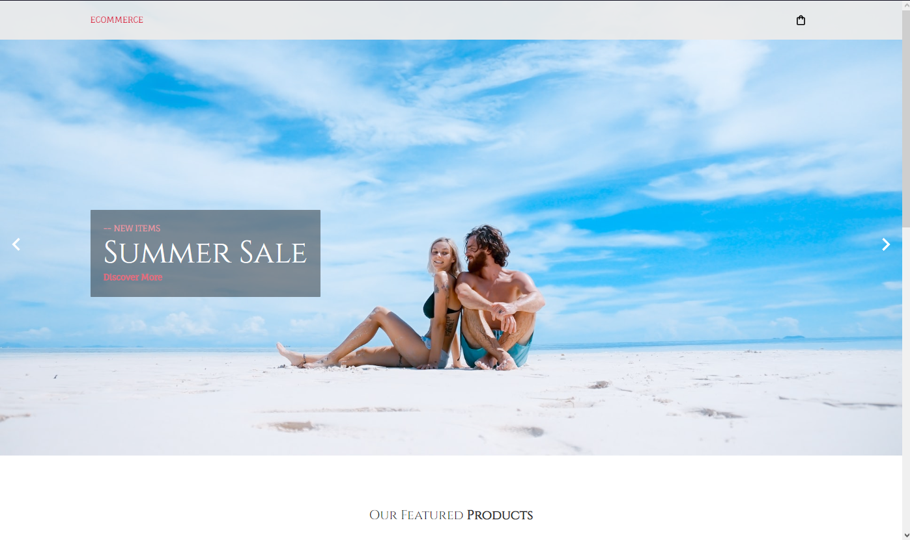
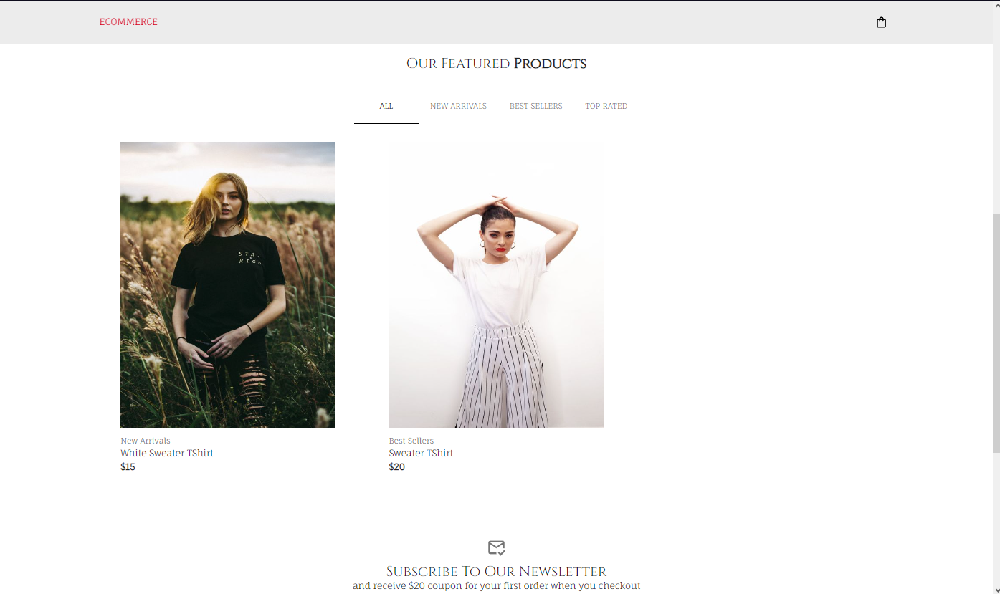
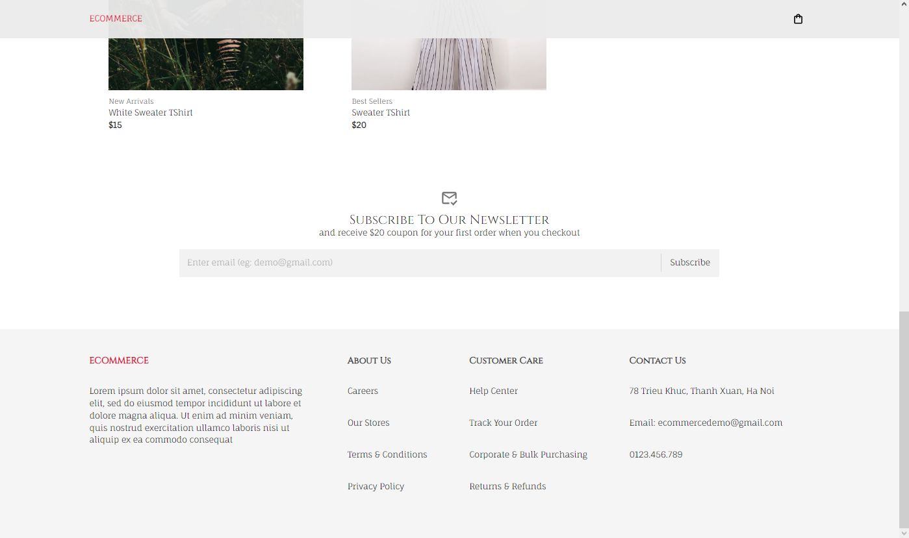

<h1 align="center"><b>ECOMMERCE DEMO WEBSITE</b></h1>

- ## Overview
React Responsive, Fullstack, Ecommerce App Tutorial from scratch. We will be using React, Material UI, Stripe, Formik, Yup, Strapi, and Redux Toolkit to build this entire application. This application will allow you to add products into a cart, have a form to fill out information and make payments through Stripe with a backend supported by Strapi

- ## Preview




- ## ⌨️ **Technology used in the project**

    - ### **Front-end**
        - Javascripts.
        - ReactJS.
        - Materials UI.
        - Redux toolkit.
        - Restful API với Axios.
    - ### **Back-end**
        - Strapi.

    - ### **Payment**
        - Stripe.

    - ### **Tools 🛠️**
        - [Vite (React)](https://vitejs.dev/)

- ## **Settings**
    - ### *Step 1*
    ```css
        git clone [myLinkProjectGitHub]
    ```

    - ### *Step 2*
    <div style='color: cyan'><p style='font-size: 20px'>Client</p></div>

    ```css
        cd [client]
    ```

    <div style='color: cyan'><p style='font-size: 20px'>Server</p></div>

    ```css
        cd [server]
    ```

    - ### *Step 3*
    ```css
        npm install
    ```

    - ### *Step 4*
    <div style='color: cyan'><p style='font-size: 20px'>Client</p></div>

    ```css
        npm run dev
    ```

    <div style='color: cyan'><p style='font-size: 20px'>Server</p></div>

    ```css
        npm run develop
    ```

- ## You can open in host:
    <div style='color: cyan'><p style='font-size: 20px'>Client</p></div>

    ```css
        localhost:5173
    ```

    <div style='color: cyan'><p style='font-size: 20px'>Server</p></div>

    ```css
        localhost:1337/admin
    ```